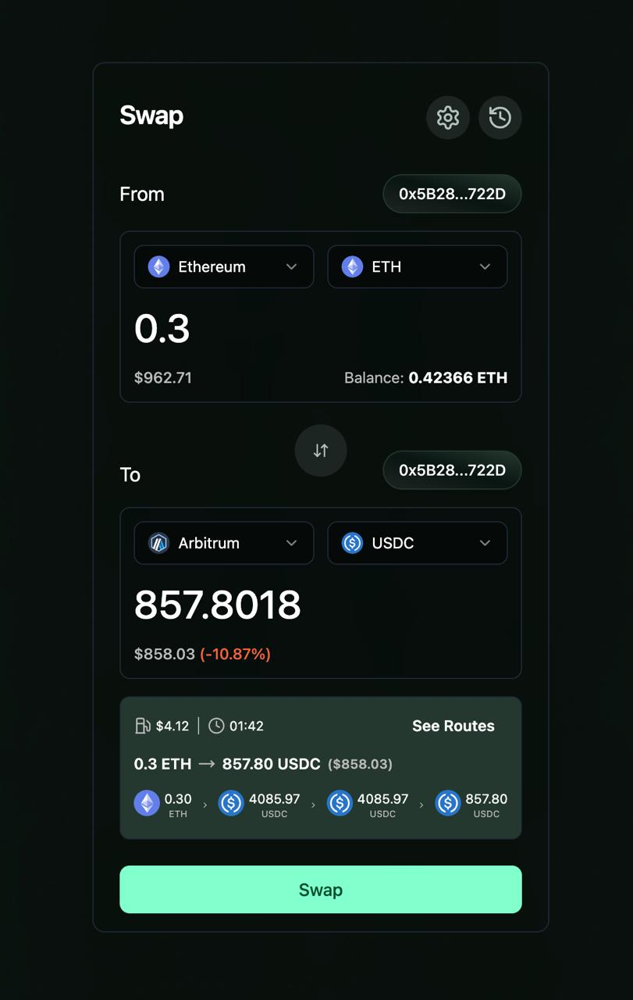
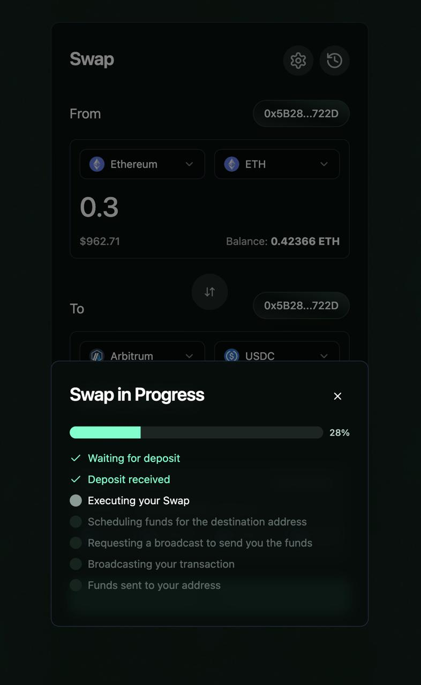
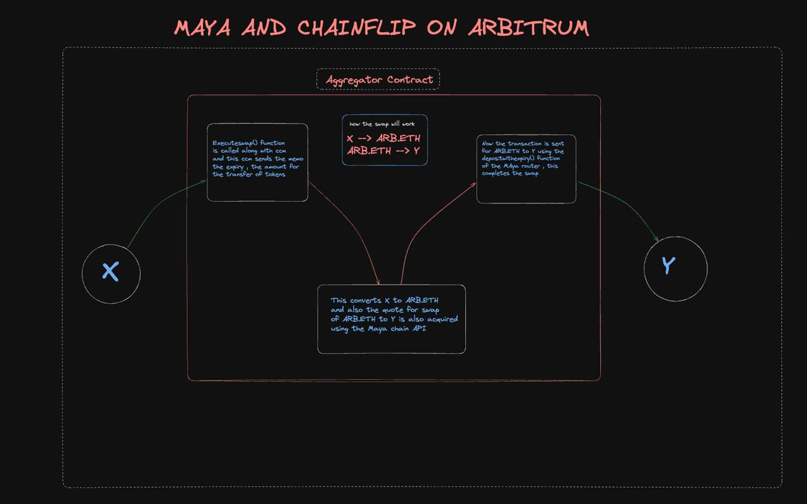

<h1>
CTM Widget
</h1>

Introducing CTM Widget: your go-to widget. Make your applications cross-chain with less than 10 lines of code!!

For more detailed explanation , have a look at our <a href="https://flipwidget.gitbook.io/ctm-widget">Wonderful Docs</a>

## What We Are

CTM Widget is engineered to be the definitive swap integration tool for a diverse range of projects from DeFi to gaming. By aggregating liquidity and functionalities from Chainflip, Thorchain, and Maya Protocol, it ensures optimal trading routes, minimal slippage, and the best possible rates for users. This widget is ideal for:

</img>
</img>

- **DeFi Platforms:** Enhance decentralized exchanges (DEXs) with state-of-the-art swap capabilities.
- **dApps:** Integrate advanced swap functionalities to provide smooth user experiences within decentralized applications.
- **Cross-Chain Solutions:** Simplify asset trading across different blockchains.

## Technical Highlights

### Protocol Aggregation

- **Chainflip:** Provides a decentralized exchange mechanism for native cross-chain swaps.
- **Thorchain:** Enhances liquidity provision and ensures high availability across asset pools.
- **Maya Protocol:** Facilitates cross-chain communication (CCM) and integrates with Chainflip to enable efficient asset swapping.

</img>

### Smooth User Experience (UX)

- **Intuitive Interface:** A clean and straightforward UI for effortless swaps.
- **Real-Time Data:** Provides up-to-date information on swap rates, liquidity, and transaction status.

### High Compatibility

- **SDK Integration:** Easily integrates into existing platforms with minimal development overhead.
- **Customizable UI:** Adaptable to match the look and feel of any host application.
- **Multi-Chain Support:** Works seamlessly across different blockchain ecosystems, leveraging the underlying protocols.

## Dive into the World of Cross Chain

CTM Widget is set to revolutionize swap integrations in DeFi projects. By offering a smooth UX, high compatibility, and advanced liquidity management, it is poised to become an indispensable tool for DeFi platforms, wallets, dApps, aggregators, and cross-chain solutions. 

Integrate CTM Widget today and unlock the full potential of seamless, efficient, and user-friendly swaps.

